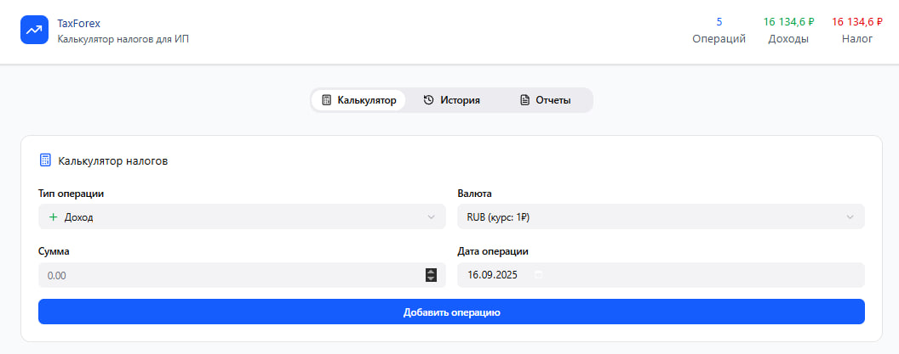
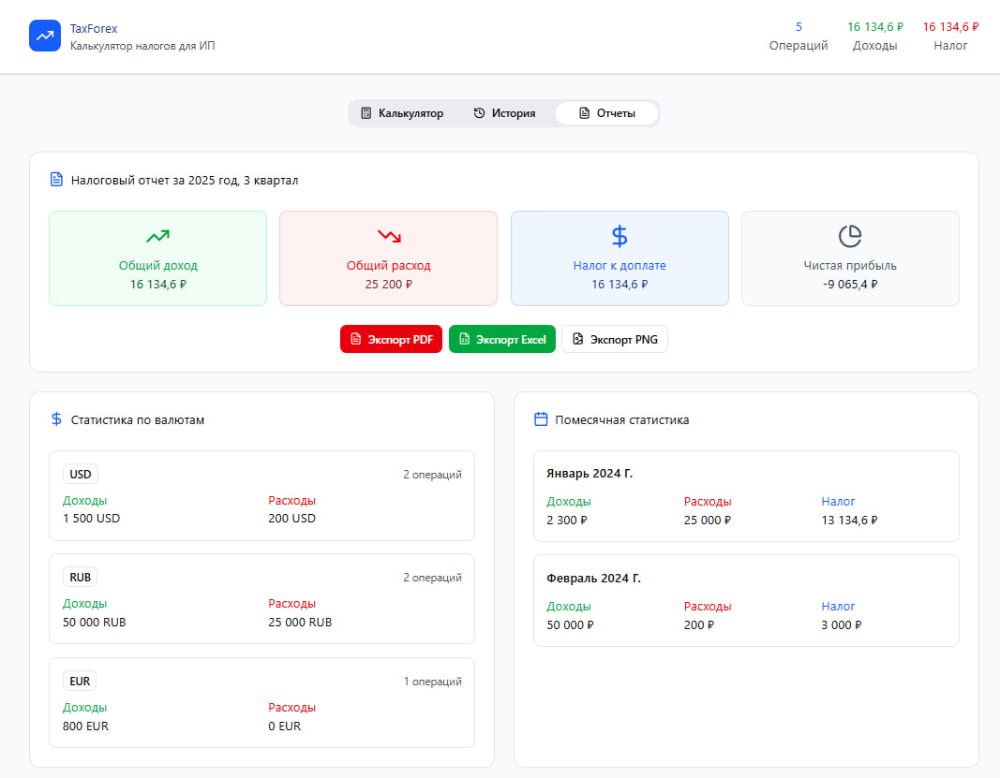

# 📋 System Requirements Specification
## TaxForex: Учет валютных операций для ИП

## 📑 Содержание
1. [Введение](#intro)  
   1.1 [Назначение](#appointment)  
   1.2 [Бизнес-требования](#business_requirements)  
   1.3 [Аналоги](#analogues)  
2. [Требования пользователя](#user_requirements)  
   2.1 [Программные интерфейсы](#software_interfaces)  
   2.2 [Интерфейс пользователя](#user_interface)  
   2.3 [Характеристики пользователей](#user_specifications)  
   2.4 [Предположения и зависимости](#assumptions_and_dependencies)  
3. [Системные требования](#system_requirements)  
   3.1 [Функциональные требования](#functional_requirements)  
   3.2 [Нефункциональные требования](#non-functional_requirements)  
4. [Эскизы интерфейса](#mockups)  
5. [Технологический стек](#tech_stack)  
6. [Безопасность и производительность](#security_performance)  
7. [Тестирование](#testing)  
8. [Развёртывание](#deployment)

---

## 1. 🧩 Введение

### 1.1 Назначение
Данный документ описывает функциональные и нефункциональные требования к веб-приложению **TaxForex**, предназначенному для автоматизации учета валютных операций и расчета налогооблагаемой базы для индивидуальных предпринимателей.

### 1.2 Бизнес-требования

#### 1.2.1 Исходные данные
Индивидуальные предприниматели, работающие с иностранными контрагентами, сталкиваются с проблемами:
- Ручной расчет рублевого эквивалента по курсу ЦБ РФ на дату операции
- Сложность учета большого количества валютных операций
- Ошибки при подготовке налоговой отчетности
- Отсутствие удобных бесплатных инструментов

#### 1.2.2 Возможности проекта
Приложение позволяет:
- Автоматизировать расчет налоговой базы по валютным операциям
- Снизить количество ошибок при учете операций в иностранной валюте
- Экономить время на подготовке налоговой отчетности
- Обеспечить соответствие требованиям налогового законодательства РФ

#### 1.2.3 Доступный функционал
Сервис охватывает:
- Автоматическое получение курсов валют ЦБ РФ
- Учет операций (доходы/расходы) в иностранной валюте
- Расчет рублевого эквивалента по курсу на дату операции
- Формирование отчетов для налоговой декларации
- Экспорт данных в форматы CSV и PDF

### 1.3 Аналоги
- **1С:Бухгалтерия** - комплексное решение, но требует покупки лицензии и обучения
- **Сайт ЦБ РФ** - предоставляет курсы валют, но не имеет функционала учета операций
- **Модуль банк-клиентов** - ограниченный функционал, привязан к конкретному банку
- **Excel-таблицы** - требуют ручного ввода данных и подвержены ошибкам

**Преимущества TaxForex**: бесплатный, специализированный под задачу, простой интерфейс, автоматизация рутинных операций.

---

## 2. 👤 Требования пользователя

### 2.1 Программные интерфейсы
- REST API для интеграции с внешними системами
- JSON для обмена данными
- API ЦБ РФ для получения курсов валют
- Экспорт в CSV и PDF форматы
- Документация API через Swagger UI

### 2.2 Интерфейс пользователя
- Веб-интерфейс с адаптивным дизайном
- Минималистичный и интуитивно понятный интерфейс
- Поддержка русской и английской локализации
- Темная и светлая темы оформления

### 2.3 Характеристики пользователей

#### 2.3.1 Аудитория приложения
- **Основная аудитория**: Индивидуальные предприниматели РФ
- **Вторичная аудитория**: Бухгалтеры, финансовые consultants
- **Техническая подготовка**: Базовые навыки работы с компьютером

#### 2.3.2 Профили пользователей
- **ИП без бухгалтера**: Самостоятельно ведут учет
- **ИП с бухгалтером**: Передают данные бухгалтеру
- **Бухгалтер**: Работает с несколькими клиентами

### 2.4 Предположения и зависимости
- Наличие доступа к интернету для получения курсов валют
- Использование современных браузеров (Chrome, Firefox, Safari, Edge)
- Хранение данных в браузере (Local Storage) или облаке (опционально)
- Зависимость от доступности API ЦБ РФ

---

## 3. ⚙️ Системные требования

### 3.1 Функциональные требования

#### 3.1.1 Управление операциями (FR1)
- **Создание операции**: Добавление новой операции с указанием даты, типа (доход/расход), валюты, суммы, назначения
- **Редактирование операции**: Изменение параметров существующей операции
- **Удаление операции**: Удаление ошибочных или дублирующих операций
- **Просмотр истории**: Отображение всех операций с фильтрацией по периоду

#### 3.1.2 Работа с курсами валют (FR2)
- **Автозагрузка курсов**: Автоматическое получение курсов ЦБ РФ на дату операции
- **Ручная корректировка**: Возможность ручного ввода курса при необходимости
- **История курсов**: Просмотр исторических данных по курсам валют
- **Поддержка валют**: USD, EUR, CNY, GBP (основные валюты)

#### 3.1.3 Расчеты и отчетность (FR3)
- **Авторасчет**: Автоматический расчет рублевого эквивалента для каждой операции
- **Итоговые суммы**: Расчет общих сумм доходов/расходов за период
- **Налоговый отчет**: Формирование отчета для раздела КУДиР
- **Валидация данных**: Проверка корректности введенных данных

#### 3.1.4 Импорт/экспорт данных (FR4)
- **Экспорт в CSV**: Выгрузка данных для дальнейшей обработки в Excel
- **Экспорт в PDF**: Формирование печатной формы отчета
- **Импорт операций**: Загрузка операций из CSV файла
- **Резервное копирование**: Сохранение и восстановление данных

#### 3.1.5 Настройки системы (FR5)
- **Настройки валют**: Выбор основных используемых валют
- **Настройки периода**: Установка налогового периода
- **Настройки округления**: Настройка правил округления сумм
- **Сброс данных**: Очистка всех данных приложения

### 3.2 Нефункциональные требования

#### 3.2.1 Производительность
- **Время отклика**: < 100 мс для большинства операций
- **Загрузка курсов**: < 2 секунд для получения данных с API ЦБ РФ
- **Формирование отчета**: < 3 секунд для отчета за квартал

#### 3.2.2 Надежность
- **Доступность**: 99.5% uptime
- **Восстановление**: Автоматическое восстановление после сбоев
- **Целостность данных**: Гарантия сохранности данных при сбоях

#### 3.2.3 Удобство использования
- **Простота интерфейса**: Добавление операции за 3 клика
- **Обучаемость**: Освоение интерфейса за 15 минут
- **Документация**: Полная документация и справка

#### 3.2.4 Совместимость
- **Браузеры**: Chrome 80+, Firefox 75+, Safari 13+, Edge 80+
- **Устройства**: Десктоп, планшеты, мобильные устройства
- **Разрешения**: Поддержка разрешений от 320px до 4K

---

## 4. 🎨 Эскизы интерфейса

### 4.1 Главный экран - Калькулятор

*Интерфейс добавления новой операции с автоматическим расчетом*

### 4.2 История операций

*Таблица с историей операций и фильтрами по дате*

### 4.3 Налоговый отчет

*Формирование налогового отчета за выбранный период*

---

## 5. 🧰 Технологический стек

| Компонент | Технология |
|-----------|------------|
| Frontend | React 18 + TypeScript |
| UI Framework | Material-UI / Ant Design |
| Charts | Chart.js / Recharts |
| Backend | Node.js + Express |
| Database | PostgreSQL / SQLite |
| API | RESTful API |
| Документация | Swagger/OpenAPI |
| Форматы данных | JSON, CSV, PDF |
| API интеграции | ЦБ РФ API |

---

## 6. 🔐 Безопасность и производительность

### 6.1 Безопасность
- Валидация всех входных данных
- Защита от XSS и SQL-инъекций
- HTTPS для всех запросов
- Локальное хранение敏感 данных

### 6.2 Производительность
- Кэширование запросов к API ЦБ РФ
- Оптимизация работы с большими объемами данных
- Ленивая загрузка компонентов интерфейса
- Компрессия передаваемых данных

### 6.3 Логирование
- Логирование ошибок и важных событий
- Мониторинг производительности
- Аналитика использования функционала

---

## 7. 🧪 Тестирование

### 7.1 Виды тестирования
- **Юнит-тесты**: Тестирование отдельных компонентов и функций
- **Интеграционные тесты**: Тестирование взаимодействия компонентов
- **E2E тесты**: Полное тестирование пользовательских сценариев
- **Тесты производительности**: Проверка времени отклика

### 7.2 Тестовые сценарии
- Добавление и редактирование операций
- Расчет рублевого эквивалента
- Формирование отчетов
- Импорт/экспорт данных
- Обработка ошибок API

---

## 8. 🚀 Развёртывание

### 8.1 Среда развертывания
- **Разработка**: Localhost с hot-reload
- **Стенд**: Docker containers
- **Прод**: Cloud platform (Vercel, Netlify, Heroku)

### 8.2 Процесс развертывания
- Автоматические билды при коммитах в main ветку
- Автоматическое тестирование перед деплоем
- Blue-green деплой для минимизации downtime
- Мониторинг работы после деплоя

### 8.3 Мониторинг
- Мониторинг доступности API
- Логирование ошибок
- Аналитика использования
- Оповещения о проблемах

---

 

> 📌 **Примечание**: Данный документ является живым документом и может быть изменен в процессе разработки проекта. Все значительные изменения должны быть согласованы с командой проекта.

> 📅 **Версия документа**: 1.0  
> 📝 **Последнее обновление**: 15.03.2024  
> 👥 **Ответственные**: [Ваше Имя], [Имя Напарника]
